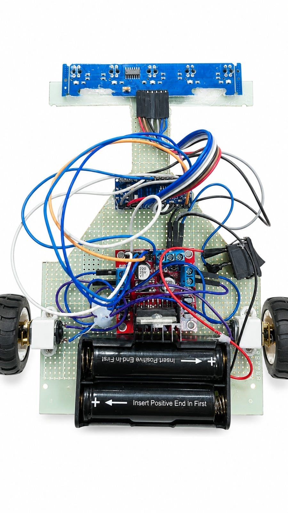
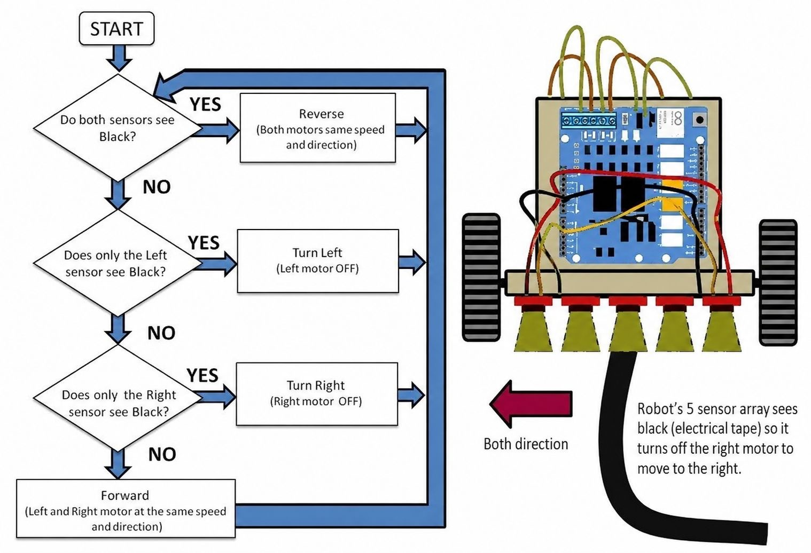
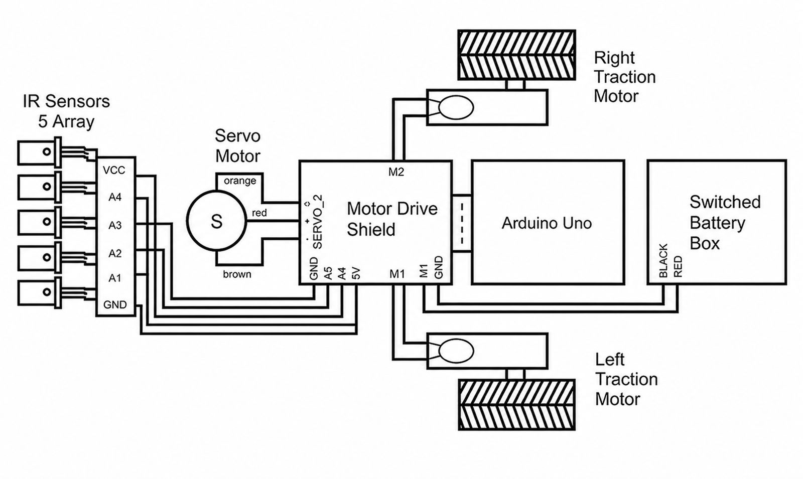

# 🤖 Autonomous Line Following Food Delivery Robot for Smart Restaurant Services

An intelligent autonomous food delivery robot designed to enhance smart restaurant services by delivering food efficiently through line-following navigation using PD control algorithms.

---

## 📸 Robot Overview

*Figure 1: Fully assembled autonomous food delivery robot*

---

## 🧠 System Flowchart

*Figure 2: Decision-making and navigation flowchart of the robot*

---

## 🔌 System Block Diagram

*Figure 3: Hardware architecture and component connection diagram*

---

# 📋 Project Description

This project presents the design and implementation of an autonomous line-following food delivery robot developed for smart restaurant environments. The robot is capable of detecting and following a predefined path autonomously while transporting food items from the kitchen to customer tables.

The system is built using the Arduino Uno microcontroller and integrates multiple sensors and motor control mechanisms to achieve accurate navigation. A 5-channel IR sensor array continuously detects the path, while a PD (Proportional-Derivative) control algorithm ensures smooth and stable movement by dynamically adjusting motor speed based on positional error.

The robot is designed to improve service efficiency, reduce human workload, and demonstrate practical applications of embedded systems and robotics in automated restaurant services.

---

# ✨ Key Features

- Autonomous line-following navigation
- Smart path detection using 5-channel IR sensors
- Stable movement using PD control algorithm
- Differential motor speed control
- Compact and efficient hardware design
- Suitable for smart restaurant automation systems

---

# ⚙️ Hardware Components

| Component | Quantity |
|-----------|----------|
| Arduino Uno | 1 |
| 5-Channel IR Sensor Array | 1 |
| L298N Motor Driver Module | 1 |
| N20 DC Gear Motor | 2 |
| Robot Chassis | 1 |
| Battery Box | 1 |
| Wheels | 2 |
| Caster Wheel | 1 |

---

# 🛠️ Technologies Used

- Embedded Systems
- Arduino Programming
- Robotics
- PD Control Algorithm
- Sensor-Based Navigation
- Motor Speed Control

---

# 🚀 Working Principle

1. The IR sensor array continuously detects the black guiding line.
2. Sensor readings are processed by the Arduino Uno.
3. The robot calculates positional error based on sensor input.
4. A PD controller computes the correction value.
5. Motor speeds are adjusted dynamically through the L298N motor driver.
6. The robot follows the path smoothly and autonomously.

---

# 🎯 Project Objectives

- Develop an autonomous delivery system for smart restaurants
- Improve food serving efficiency
- Reduce manual labor in restaurant operations
- Demonstrate practical implementation of robotics and automation
- Apply embedded systems and control engineering concepts

---

# 🔬 Future Improvements

- Obstacle detection and avoidance
- Bluetooth/Wi-Fi remote monitoring
- Table number recognition system
- Voice announcement system
- Automatic charging dock
- AI-based route optimization

---

# 👨‍💻 Author
Mohammad Nayeemur Rashid 

Department of Computer Science and Engineering  
Port City International University

---

# 📜 License

This project is licensed under the MIT License.

